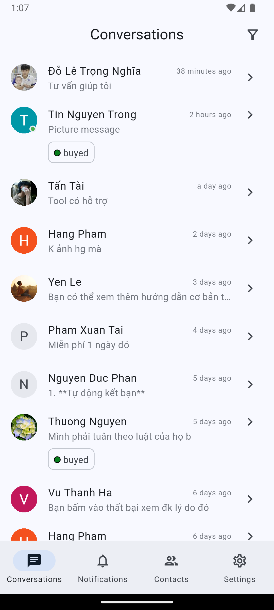
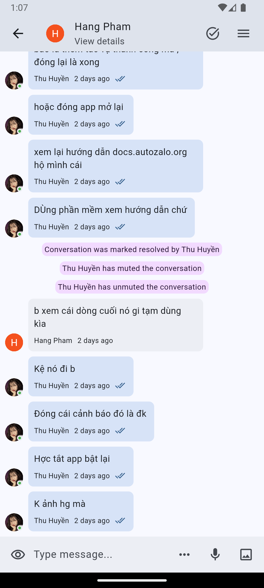
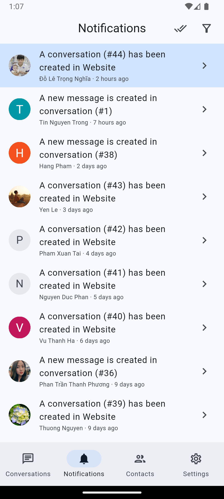
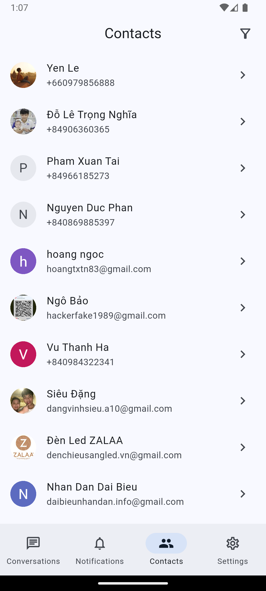
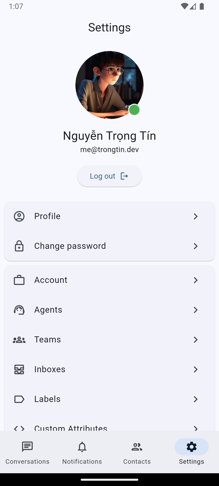

    
    
    
    
    
    

---

# chatwoot

Cross-Platform app for chatwoot! Built with Flutter.

## Support

| Platform | Status         |
| -------- | -------------- |
| Web      | 🕛 Planned     |
| Mobile   | 💪 In-Progress |
| Desktop  | 🕛 Planned     |

## Roadmap

| Feature                      | Status         |
| ---------------------------- | -------------- |
| UI - Customize theme         | ✅ Completed   |
| Settings                     | 💪 In-Progress |
| Conversations                | 💪 In-Progress |
| Contacts                     | 💪 In-Progress |
| Notifications                | 💪 In-Progress |
| Push Notifications           | 💪 In-Progress |
| Reports                      | 🕛 Planned     |
| Teams (Partially)            | 🕛 Planned     |
| Accounts (Partially)         | 🕛 Planned     |
| Inboxes (Partially)          | 💪 In-Progress |
| Labels                       | 💪 In-Progress |
| Automation                   | 🕛 Planned     |
| Macros (Partially)           | 💪 In-Progress |
| Agents                       | 🕛 Planned     |
| Canned Response              | 💪 In-Progress |
| Integrations (Partially)     | 🕛 Planned     |
| Audit Logs                   | 🕛 Planned     |
| Custom Attributes            | 💪 In-Progress |
| Campaigns                    | 🕛 Planned     |
| Realtime                     | 💪 In-Progress |
| Improve performace by SQLite | 💪 In-Progress |

## Feedback & Contributing

Feel free to send us feedback on [file an issue](https://github.com/trongtindev/chatwoot-flutter/issues).
