# chatwoot

Cross-Platform app for chatwoot! Built with Flutter.

    
    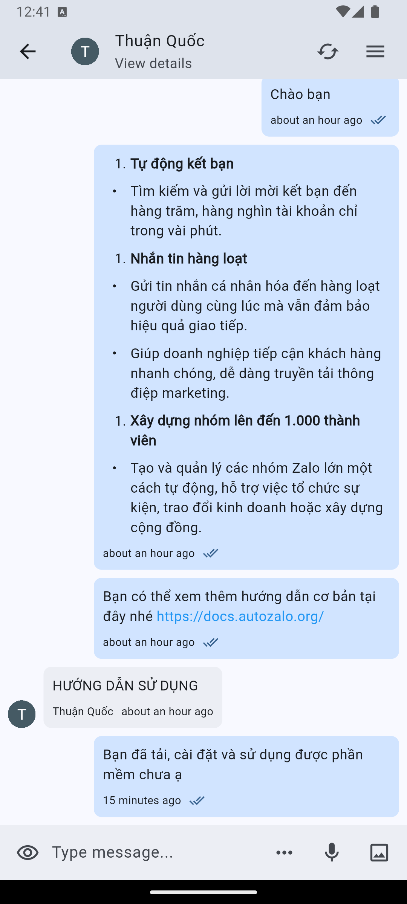
    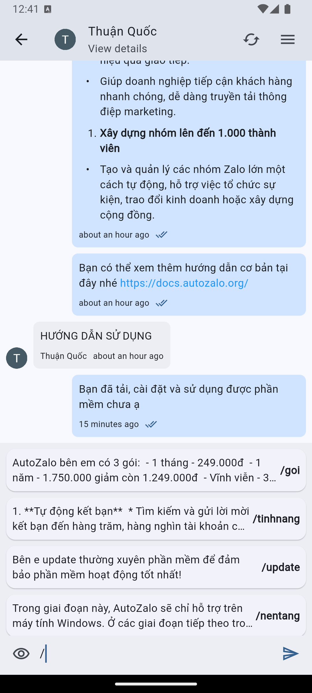
    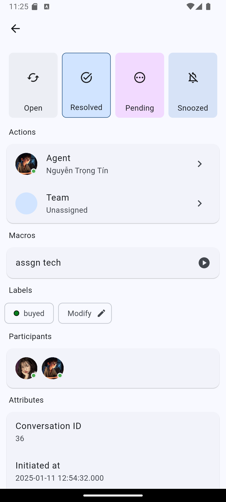
    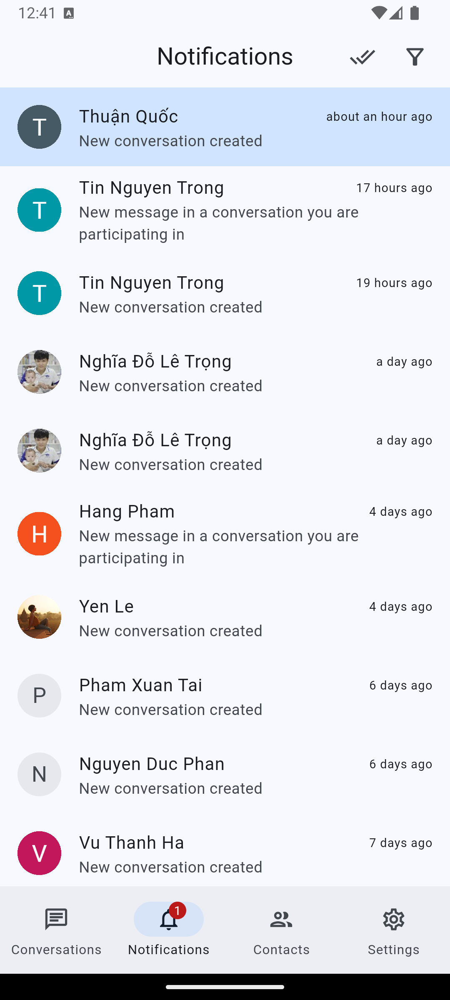
    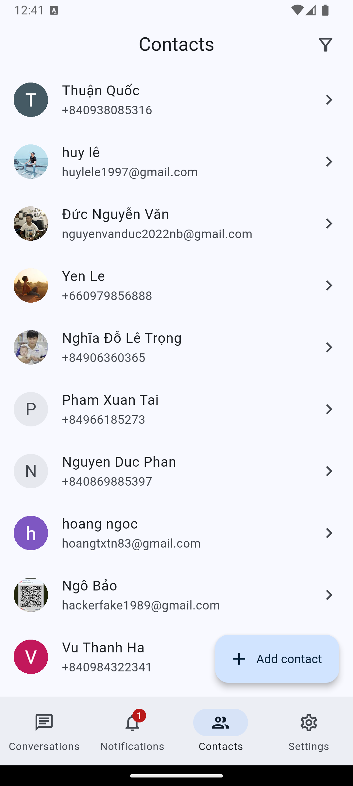
    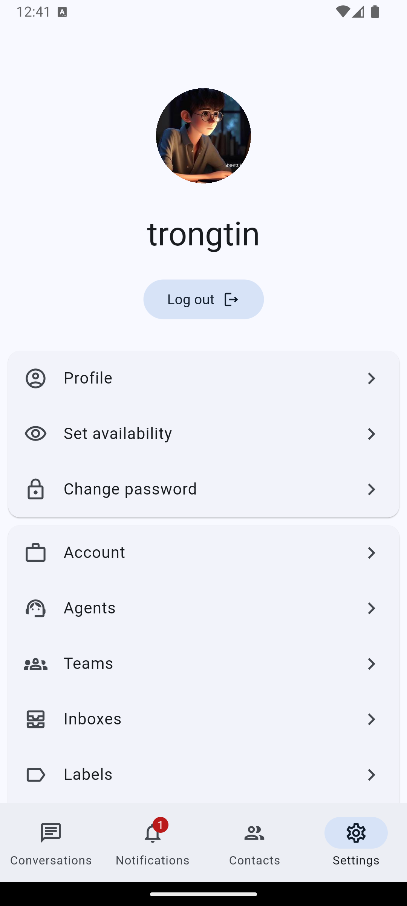

    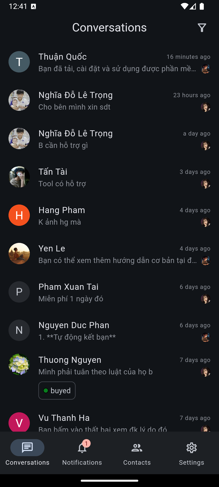
    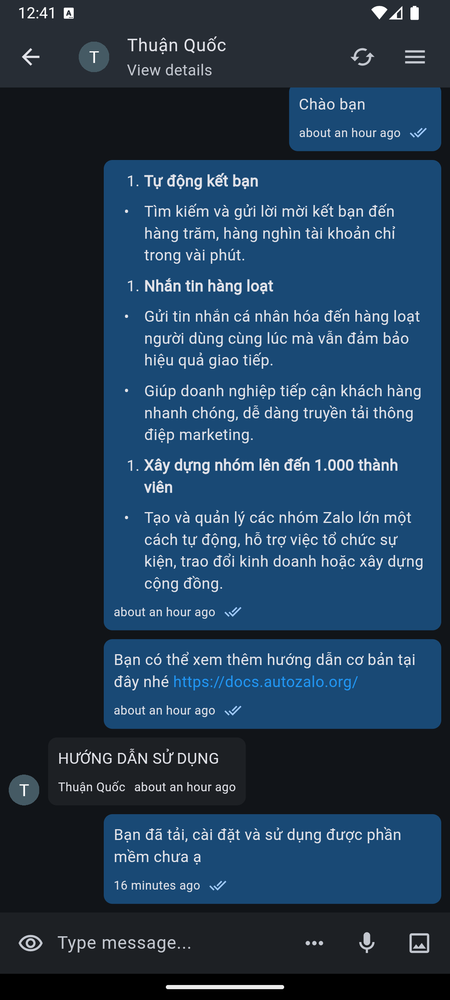
    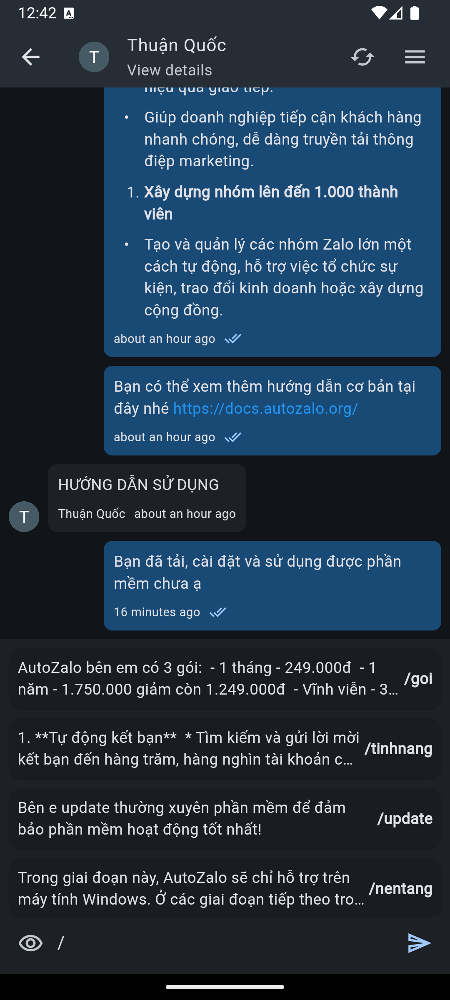
    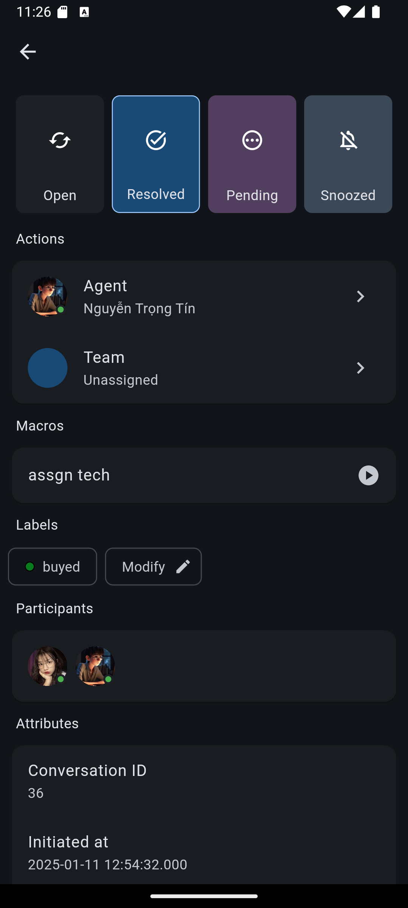
    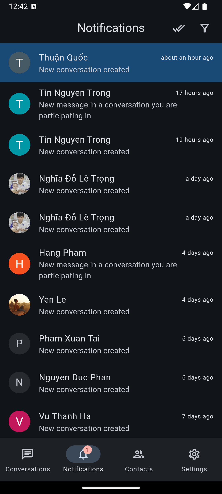
    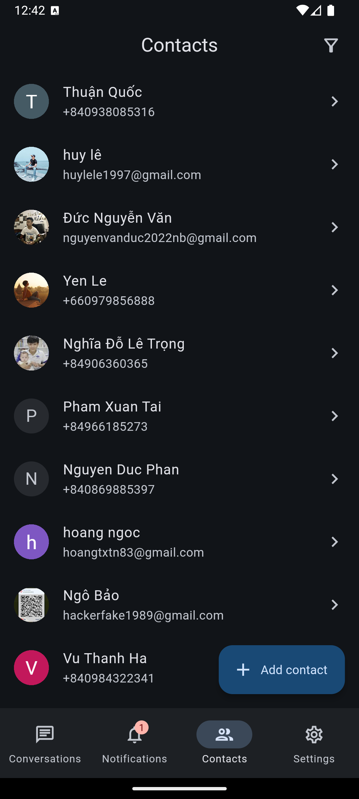
    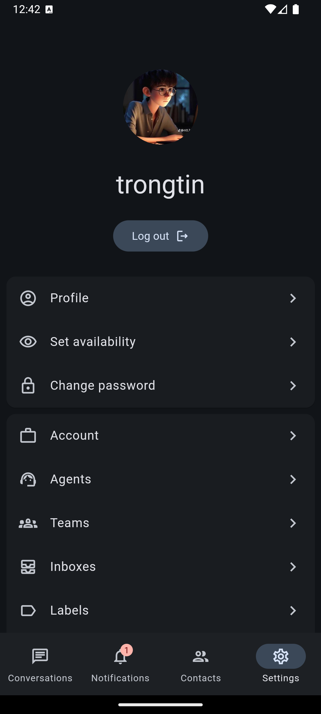

## ⚠️ Important Notice

This is an unofficial Chatwoot client. Push notifications require additional configuration:

- You need to set up your own Firebase project
- Configure server-side credentials
- Add your own google-services.json file

See the [documentation](docs/push-notifications.md) for setup instructions.

## Download

Get the latest version from the [Releases page](https://github.com/trongtindev/chatwoot-flutter/releases).

## Features

- Real-time customer engagement
- Mobile-first conversation management
- Quick replies with canned responses
- Real-time activity notifications
- Team collaboration via private notes
- Multi-language message translation
- Conversation statuses, recording, macros and more!

## Platform Support

| Platform | Status         |
| -------- | -------------- |
| Mobile   | 💪 In-Progress |
| Desktop  | 🕛 Planned     |

## Roadmap

| Feature              | Status         |
| -------------------- | -------------- |
| UI - Customize theme | ✅ Completed   |
| Settings             | 💪 In-Progress |
| Conversations        | ✅ Completed   |
| Message Translation  | ✅ Completed   |
| Contacts             | ✅ Completed   |
| Notifications        | 💪 In-Progress |
| Push Notifications   | ☑️ Not tested  |
| Reports              | 🕛 Planned     |
| Teams                | 💪 In-Progress |
| Accounts             | 🕛 Planned     |
| Inboxes (Webview)    | ✅ Completed   |
| Labels               | 💪 In-Progress |
| Automation (Webview) | 💪 In-Progress |
| Macros (Webview)     | 💪 In-Progress |
| Agents               | 💪 In-Progress |
| Canned Response      | 💪 In-Progress |
| Integrations         | 🕛 Planned     |
| Audit Logs           | 🕛 Planned     |
| Custom Attributes    | 💪 In-Progress |
| Campaigns            | 🕛 Planned     |
| Realtime             | ✅ Completed   |

## Contributing

Feel free to send us feedback by [filing an issue](https://github.com/trongtindev/chatwoot-flutter/issues).
