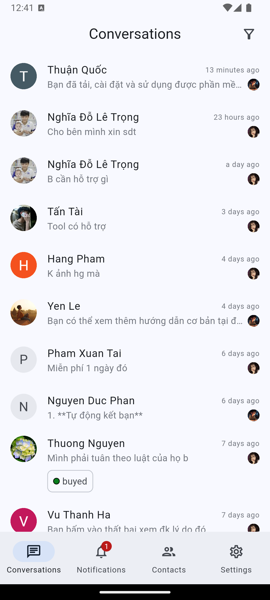

# chatwoot

Cross-Platform app for chatwoot! Built with Flutter.

<p align="center">
    
    
    
    
    
    
    
</p>

<p align="center">
    
    
    
    
    
    
    
</p>

## Features

- Do not miss out on the new customers
- Follow up on customer conversations on go
- Reply easily with canned responses
- Receive realtime notifications about system activities
- Communicate with other team members via private notes
- Assign statuses to your conversations, recorder, execute macro... and more to come!

```
⚠️ This repo is unofficial, so you will not receive push notifications as I do not have client credentials. You need to configure yourself to work!
```

## Support

| Platform | Status         |
| -------- | -------------- |
| Mobile   | 💪 In-Progress |
| Desktop  | 🕛 Planned     |

## Roadmap

| Feature                  | Status         |
| ------------------------ | -------------- |
| UI - Customize theme     | ✅ Completed   |
| Settings (Partially)     | 💪 In-Progress |
| Conversations            | 💪 In-Progress |
| Contacts                 | 💪 In-Progress |
| Notifications            | 💪 In-Progress |
| Push Notifications       | ☑️ Not tested  |
| Reports                  | 🕛 Planned     |
| Teams (Partially)        | 💪 In-Progress |
| Accounts (Partially)     | 🕛 Planned     |
| Inboxes (Partially)      | 💪 In-Progress |
| Labels                   | 💪 In-Progress |
| Automation (Partially)   | 🕛 Planned     |
| Macros (Partially)       | 💪 In-Progress |
| Agents                   | 💪 In-Progress |
| Canned Response          | 💪 In-Progress |
| Integrations (Partially) | 🕛 Planned     |
| Audit Logs               | 🕛 Planned     |
| Custom Attributes        | 💪 In-Progress |
| Campaigns                | 🕛 Planned     |
| Realtime                 | ✅ Completed   |

## Feedback & Contributing

Feel free to send us feedback on [file an issue](https://github.com/trongtindev/chatwoot-flutter/issues).
